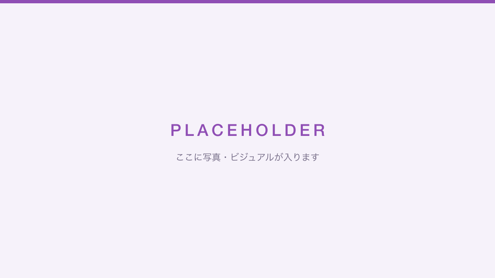

<!-- このページはたたき台です。「要確認」と書かれた箇所はオーナー確認のうえ書き換え・削除してください -->

<!-- 要確認: 上の仮画像を実際の写真・ビジュアルに差し替え(images/ に置いて相対パスで参照) -->

## プロフィール

**sKawashima**(かわしま)

UI/UX デザインからフロントエンド実装までを一貫して担当できることを強みに、Web サービスの企画・設計・開発に携わっています。学生時代から Web 制作・映像制作・作曲まで幅広い制作活動を続けており、「作りたいものを、デザインと技術の両面から形にする」ことを大切にしています。

<!-- 要確認: 現在の所属・肩書き(会社名 / 職種 / フリーランス等)をここに追記 -->

## できること

### UI/UX デザイン

企画段階からのコンセプト立案、情報設計、UI デザインまで対応できます。ハッカソンでは企画提案と UI/UX デザインを担当し、短期間でのプロトタイピングを得意としています。

- 使用ツール: Illustrator / XD / Sketch / Photoshop

### フロントエンド開発

デザインの意図を汲んだ実装を、設計から一人で完結できます。コンポーネント設計・静的サイト構築・PWA など、モダンフロントエンドの実務経験があります。

- 言語: TypeScript / JavaScript / HTML / CSS(Sass)
- フレームワーク等: Vue / Nuxt / Svelte / Astro / Storybook

### そのほかの制作

- **バックエンド**: Node.js / PHP(WordPress)/ MongoDB など、小〜中規模の API・CMS 構築
- **映像制作**: After Effects / Premiere Pro による PV・イメージ映像の制作
- **作曲**: Ableton Live による楽曲制作・空間演出

## 活動歴

<!-- 要確認: 学歴・職歴の正式名称と年を確認して書き換え -->

- 2014〜2018年: 大学在学中に受注制作・課外活動・アーティスト活動として Web / 映像 / 音楽を制作(詳細は [Works](/works/) を参照)
- SPAJAM 2018 / JPHACKS 2018 / SPAJAM 2019 などのハッカソンに出場
- 2018年〜: ソフトウェアエンジニアとして勤務 <!-- 要確認: 社名・担当領域 -->

制作物の詳細は [Works](/works/) に、技術的な発信は [Blog](/blog/) にまとめています。

## リンク

- GitHub: [sKawashima](https://github.com/sKawashima)
- X: [@_sKawashima](https://x.com/_sKawashima)

<!-- 要確認: 連絡先(メール等)を載せる場合はここに追記 -->
